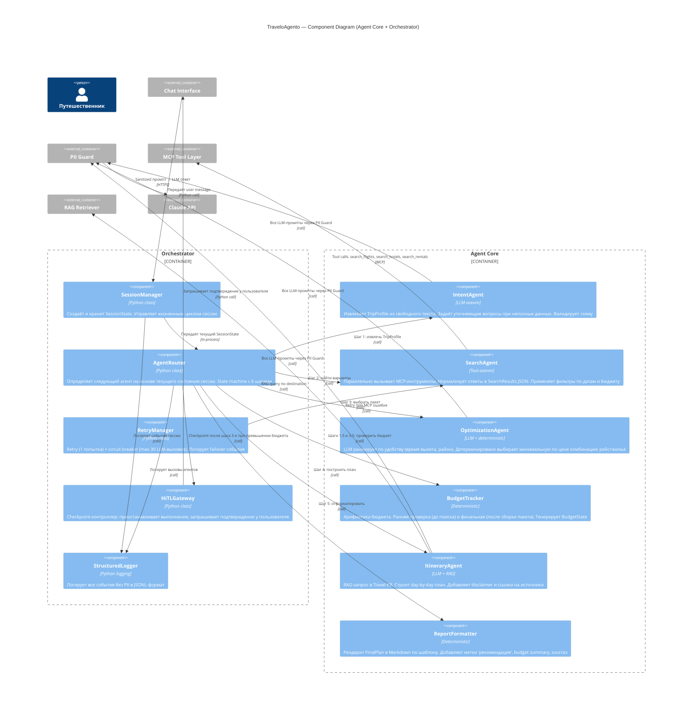
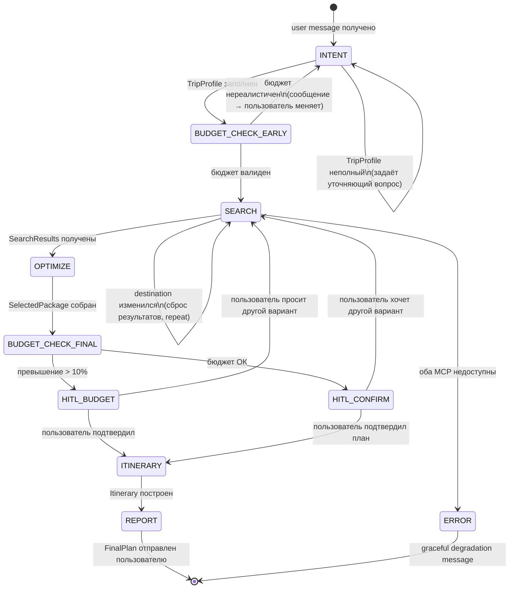

# C4 Component — Agent Core & Orchestrator

Внутреннее устройство ядра системы: как Orchestrator управляет агентами и как агенты устроены внутри.

```mermaid
C4Component
    title TraveloAgento — Component Diagram (Agent Core + Orchestrator)

    Person(user, "Путешественник")
    Container_Ext(ui, "Chat Interface")
    Container_Ext(pii_guard, "PII Guard")
    Container_Ext(mcp_layer, "MCP Tool Layer")
    Container_Ext(retriever, "RAG Retriever")
    Container_Ext(llm_api, "Claude API")

    Container_Boundary(orchestrator_c, "Orchestrator") {
        Component(session_mgr, "SessionManager", "Python class", "Создаёт и хранит SessionState. Управляет жизненным циклом сессии")
        Component(router, "AgentRouter", "Python class", "Определяет следующий агент на основе текущего состояния сессии. State machine с 6 шагами")
        Component(retry_mgr, "RetryManager", "Python class", "Retry (1 попытка) + circuit breaker (max 30 LLM-вызовов). Логирует failover события")
        Component(hitl, "HiTLGateway", "Python class", "Checkpoint-контроллер: приостанавливает выполнение, запрашивает подтверждение у пользователя")
        Component(logger_comp, "StructuredLogger", "Python logging", "Логирует все события без PII в JSONL-формат")
    }

    Container_Boundary(agent_core_c, "Agent Core") {
        Component(intent_agent, "IntentAgent", "LLM-агент", "Извлекает TripProfile из свободного текста. Задаёт уточняющие вопросы при неполных данных. Валидирует схему")
        Component(search_agent, "SearchAgent", "Tool-агент", "Параллельно вызывает MCP-инструменты. Нормализует ответы в SearchResults JSON. Применяет фильтры по датам и бюджету")
        Component(optim_agent, "OptimizationAgent", "LLM + deterministic", "LLM ранжирует по удобству (время вылета, район). Детерминировано выбирает минимальную по цене комбинацию рейс×жильё")
        Component(budget_tracker, "BudgetTracker", "Deterministic", "Арифметика бюджета. Ранняя проверка (до поиска) и финальная (после сборки пакета). Генерирует BudgetState")
        Component(itinerary_agent, "ItineraryAgent", "LLM + RAG", "RAG-запрос в Travel KB. Строит day-by-day план. Добавляет disclaimer и ссылки на источники")
        Component(report_fmt, "ReportFormatter", "Deterministic", "Рендерит FinalPlan в Markdown по шаблону. Добавляет метки 'рекомендация', budget summary, sources")
    }

    Rel(ui, session_mgr, "Передаёт user message", "Python call")
    Rel(session_mgr, router, "Передаёт текущий SessionState", "in-process")
    Rel(router, intent_agent, "Шаг 1: извлечь TripProfile", "call")
    Rel(router, search_agent, "Шаг 2: найти варианты", "call")
    Rel(router, optim_agent, "Шаг 3: выбрать пакет", "call")
    Rel(router, budget_tracker, "Шаги 1.5 и 3.5: проверить бюджет", "call")
    Rel(router, itinerary_agent, "Шаг 4: построить план", "call")
    Rel(router, report_fmt, "Шаг 5: отформатировать", "call")
    Rel(router, hitl, "Checkpoint после шага 3 и при превышении бюджета", "call")
    Rel(hitl, ui, "Запрашивает подтверждение у пользователя", "Python call")
    Rel(intent_agent, pii_guard, "Все LLM-промпты через PII Guard", "call")
    Rel(optim_agent, pii_guard, "Все LLM-промпты через PII Guard", "call")
    Rel(itinerary_agent, pii_guard, "Все LLM-промпты через PII Guard", "call")
    Rel(pii_guard, llm_api, "Sanitized промпт → LLM ответ", "HTTPS")
    Rel(search_agent, mcp_layer, "Tool calls: search_flights, search_hotels, search_rentals", "MCP")
    Rel(itinerary_agent, retriever, "RAG query по destination", "call")
    Rel(retry_mgr, search_agent, "Retry при MCP ошибке", "call")
    Rel(session_mgr, logger_comp, "Логирует события сессии", "call")
    Rel(router, logger_comp, "Логирует вызовы агентов", "call")

    UpdateLayoutConfig($c4ShapeInRow="3", $c4BoundaryInRow="2")
```

## AgentRouter — State Machine

```mermaid
stateDiagram-v2
    [*] --> INTENT : user message получено

    INTENT --> INTENT : TripProfile неполный\n(задаёт уточняющий вопрос)
    INTENT --> BUDGET_CHECK_EARLY : TripProfile заполнен

    BUDGET_CHECK_EARLY --> INTENT : бюджет нереалистичен\n(сообщение → пользователь меняет)
    BUDGET_CHECK_EARLY --> SEARCH : бюджет валиден

    SEARCH --> SEARCH : destination изменился\n(сброс результатов, repeat)
    SEARCH --> OPTIMIZE : SearchResults получены

    OPTIMIZE --> BUDGET_CHECK_FINAL : SelectedPackage собран

    BUDGET_CHECK_FINAL --> HITL_BUDGET : превышение > 10%
    HITL_BUDGET --> SEARCH : пользователь просит другой вариант
    HITL_BUDGET --> ITINERARY : пользователь подтвердил

    BUDGET_CHECK_FINAL --> HITL_CONFIRM : бюджет ОК

    HITL_CONFIRM --> ITINERARY : пользователь подтвердил план
    HITL_CONFIRM --> SEARCH : пользователь хочет другой вариант

    ITINERARY --> REPORT : Itinerary построен
    REPORT --> [*] : FinalPlan отправлен пользователю

    SEARCH --> ERROR : оба MCP недоступны
    ERROR --> [*] : graceful degradation message
```
