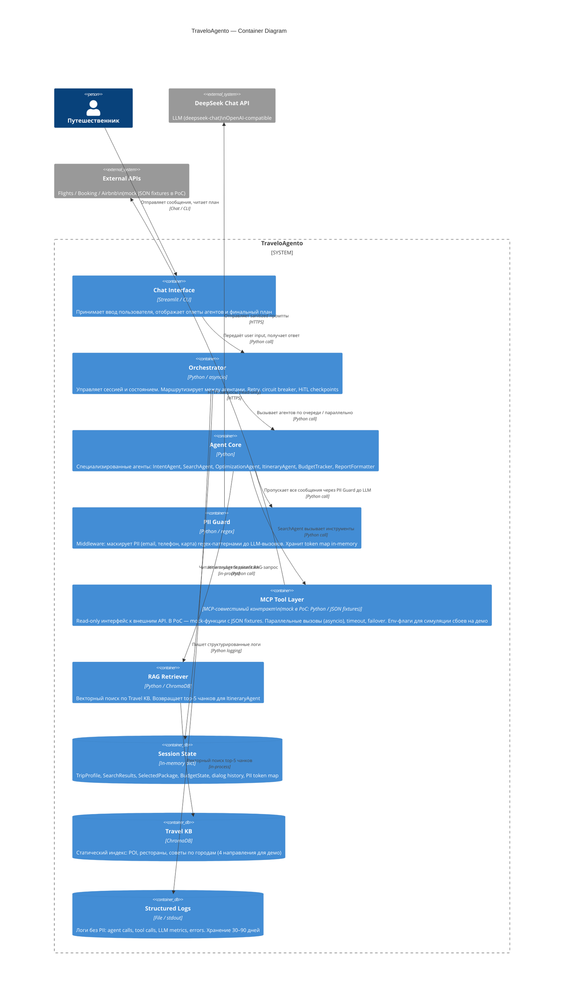

# C4 Container — TraveloAgento

Как система устроена изнутри: основные исполняемые блоки, их технологии и взаимодействие.

## Технологический стек (PoC)

| Контейнер | Технология | Обоснование |
|---|---|---|
| Chat Interface | Python CLI (`input()` loop) | Минимальный UI для демо, без зависимостей |
| Orchestrator | Python + asyncio | Нативная параллельность для SearchAgent |
| Agent Core | Python + openai SDK | DeepSeek API (OpenAI-compatible) |
| PII Guard | Python regex | Email/phone/card паттерны, без тяжёлых зависимостей |
| MCP Tool Layer | Python + JSON fixtures (PoC) → MCP SDK (production) | MCP-совместимый контракт; mock заменяется на реальный MCP-сервер без изменений в агентах |
| RAG Retriever | ChromaDB + sentence-transformers | Локально, без внешнего сервиса |
| Session State | Python dataclass (in-process) | Достаточно для PoC, нет PII на диске |
| Logs | Python logging → JSONL | Structured, без PII, легко парсить |
