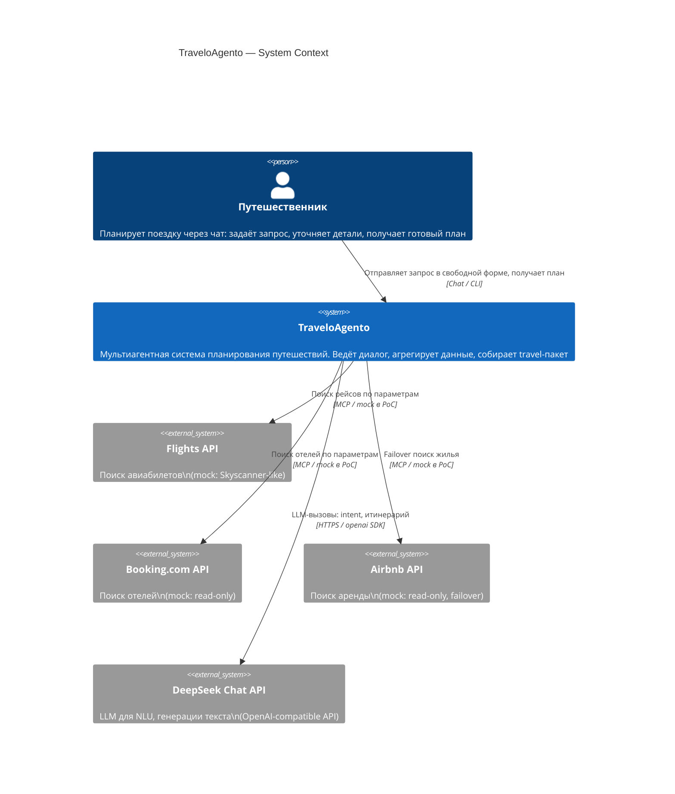

# C4 Context — TraveloAgento

Кто взаимодействует с системой и какие внешние сервисы она использует.

## Границы системы

| Внутри системы | Вне системы |
|---|---|
| Весь агентский слой (Orchestrator, агенты, PII Guard) | Реальные API провайдеров (в PoC — mock) |
| Travel KB и vector store | LLM-провайдер (DeepSeek Chat API) |
| Session State и логи | Платёжные системы (out-of-scope) |
| MCP Tool Layer (mock в PoC) | Визовые и паспортные сервисы (out-of-scope) |
