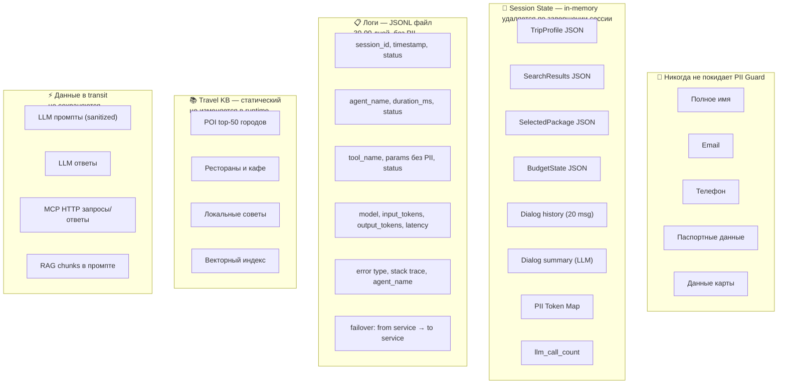

# Data Flow Diagram — TraveloAgento

Как данные проходят через систему: что трансформируется, что хранится, что логируется, что никогда не покидает систему.

```mermaid
flowchart LR
    USER(["👤 Пользователь"])

    subgraph INGRESS ["Вход данных"]
        RAW["raw user message\n'хочу в Тюмень на 5 дней...'"]
        PII_GUARD["🛡️ PII Guard\nregex + NER маскировка"]
        SANITIZED["sanitized message\n'хочу в [CITY] на 5 дней...'"]
        TOKEN_MAP[("🔑 PII Token Map\nin-memory only\nудаляется по окончании")]
    end

    subgraph INTENT ["Intent Layer"]
        LLM1["IntentAgent\nLLM call"]
        TRIP_PROFILE["TripProfile JSON\n{destination, dates,\ntravelers, budget}"]
        VALIDATION["Schema Validation\ndeteministic"]
    end

    subgraph SEARCH ["Search Layer"]
        MCP_F["MCP: search_flights\nread-only"]
        MCP_H["MCP: search_hotels\nread-only"]
        MCP_A["MCP: search_rentals\nfailover"]
        NORMALIZE["Нормализация ответов\ndeterministic"]
        SEARCH_RES["SearchResults JSON\ntop-5 flights\ntop-5 accommodations"]
    end

    subgraph OPTIM ["Optimization Layer"]
        LLM2["OptimizationAgent\nLLM call"]
        BUDGET_1["BudgetTracker\nearly check"]
        BUDGET_2["BudgetTracker\nfinal check"]
        PKG["SelectedPackage JSON\n{flight, hotel,\ntotal_cost, remaining}"]
    end

    subgraph RAG ["RAG Layer"]
        QUERY["Query Builder\n'{city} attractions restaurants'"]
        VECTOR["Travel KB\nChromaDB / FAISS"]
        CHUNKS["top-5 чанков\nPOI, рестораны, советы"]
        EXT_DATA["<external_data> блок\n(untrusted zone в промпте)"]
    end

    subgraph GENERATION ["Generation Layer"]
        LLM3["ItineraryAgent\nLLM call"]
        FORMATTER["ReportFormatter\ndeterministic template"]
        FINAL["FinalPlan Markdown\nрейс + жильё +\nитинерарий + бюджет\n+ disclaimer + sources"]
    end

    subgraph STATE ["Session State\nin-memory dict"]
        SS[("SessionState\n· trip_profile\n· search_results\n· selected_package\n· budget_state\n· dialog_history 20 msg\n· summary\n· llm_call_count")]
    end

    subgraph LOGS ["Structured Logs\nJSONL — без PII"]
        LOG_SESS["session_start / end"]
        LOG_AGENT["agent_call\n{name, duration_ms, status}"]
        LOG_TOOL["tool_call\n{tool, params_no_pii, status}"]
        LOG_LLM["llm_call\n{model, in_tokens, out_tokens, latency}"]
        LOG_ERR["error\n{type, stack, agent}"]
        LOG_FAIL["failover_event\n{from, to, reason}"]
    end

    subgraph EXT ["Внешние системы"]
        FLIGHTS_API[/"Flights API\nmock"/]
        BOOKING_API[/"Booking API\nmock"/]
        AIRBNB_API[/"Airbnb API\nmock failover"/]
        CLAUDE_API[/"Claude API\nAnthropic"/]
    end

    %% Input flow
    USER -->|"сообщение"| RAW
    RAW --> PII_GUARD
    PII_GUARD -->|"sanitized"| SANITIZED
    PII_GUARD -->|"сохраняет маппинг"| TOKEN_MAP
    SANITIZED --> LLM1

    %% Intent flow
    LLM1 -->|"LLM prompt"| CLAUDE_API
    CLAUDE_API -->|"structured response"| TRIP_PROFILE
    TRIP_PROFILE --> VALIDATION
    VALIDATION -->|"сохраняет"| SS
    BUDGET_1 -->|"читает"| TRIP_PROFILE

    %% Search flow
    VALIDATION --> MCP_F & MCP_H
    MCP_F -->|"HTTP read-only"| FLIGHTS_API
    FLIGHTS_API -->|"JSON response"| MCP_F
    MCP_H -->|"HTTP read-only"| BOOKING_API
    BOOKING_API -->|"JSON response"| MCP_H
    MCP_H -->|"failover"| MCP_A
    MCP_A -->|"HTTP read-only"| AIRBNB_API
    AIRBNB_API -->|"JSON response"| MCP_A
    MCP_F & MCP_H --> NORMALIZE
    NORMALIZE --> SEARCH_RES
    SEARCH_RES -->|"сохраняет"| SS

    %% Optimization flow
    SEARCH_RES --> LLM2
    LLM2 -->|"LLM prompt"| CLAUDE_API
    CLAUDE_API -->|"ranking + selection"| PKG
    PKG --> BUDGET_2
    BUDGET_2 -->|"сохраняет"| SS
    PKG -->|"сохраняет"| SS

    %% RAG flow
    PKG --> QUERY
    QUERY --> VECTOR
    VECTOR -->|"cosine similarity"| CHUNKS
    CHUNKS --> EXT_DATA

    %% Generation flow
    EXT_DATA --> LLM3
    PKG --> LLM3
    LLM3 -->|"LLM prompt + <external_data>"| CLAUDE_API
    CLAUDE_API -->|"day-by-day plan"| LLM3
    LLM3 --> FORMATTER
    FORMATTER --> FINAL
    FINAL -->|"показывает план"| USER

    %% Logging (все события)
    PII_GUARD -.->|"session event"| LOG_SESS
    LLM1 & LLM2 & LLM3 -.->|"tokens, latency"| LOG_LLM
    MCP_F & MCP_H & MCP_A -.->|"tool call, params_no_pii"| LOG_TOOL
    NORMALIZE -.->|"failover event"| LOG_FAIL
    VALIDATION -.->|"agent call, duration"| LOG_AGENT
    FORMATTER -.->|"session end"| LOG_SESS

    style TOKEN_MAP fill:#fde8e8,stroke:#f44336
    style PII_GUARD fill:#fff3cd,stroke:#ff9800
    style EXT_DATA fill:#fff3cd,stroke:#ff9800
    style LOGS fill:#f5f5f5,stroke:#9e9e9e
    style STATE fill:#e8f0fe,stroke:#3f51b5
    style EXT fill:#f3e5f5,stroke:#9c27b0
```

---

## Что хранится, что логируется, что нельзя

---

## Трансформации данных по слоям

| Слой | Вход | Выход | Тип обработки |
|---|---|---|---|
| PII Guard | raw user message | sanitized message + token_map | regex + NER (deterministic) |
| IntentAgent | sanitized message | TripProfile JSON | LLM |
| Schema Validation | TripProfile JSON | validated TripProfile / error | deterministic |
| BudgetTracker (early) | TripProfile.budget | ok / nok + message | deterministic (arithmetic) |
| SearchAgent | TripProfile | SearchResults JSON (top-5×2) | MCP tool calls + normalization |
| OptimizationAgent | SearchResults | SelectedPackage JSON | LLM (ranking) + deterministic (cost) |
| BudgetTracker (final) | SelectedPackage.total_cost | BudgetState JSON | deterministic |
| RAG Retriever | destination string | top-5 text chunks | vector similarity search |
| ItineraryAgent | SelectedPackage + chunks | Itinerary JSON | LLM + RAG context |
| ReportFormatter | SelectedPackage + Itinerary | FinalPlan Markdown | deterministic template |
