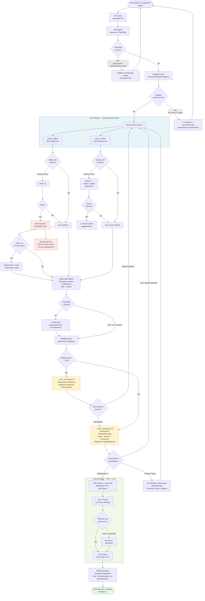

# Workflow Diagram — Execution Flow

Пошаговое выполнение запроса от user input до финального плана, включая все ветки ошибок и HiTL-точки.

## Ветки ошибок — сводка

| Ветка | Триггер | Поведение |
|---|---|---|
| Неполный TripProfile | Отсутствует destination / даты / бюджет | Уточняющий вопрос, цикл продолжается |
| Нереалистичный бюджет | min_market_price > budget | Сообщение + предложение альтернатив, не падает |
| Flights API недоступен | Timeout + retry fail | Degraded mode, сессия завершается gracefully |
| Booking недоступен | Timeout + retry fail | Failover на Airbnb, пользователь уведомлён |
| Оба жилья недоступны | Airbnb timeout fail | Только рейсы + уведомление |
| Рейсов на точные даты нет | Empty flight results | Предложение ±3 дня |
| Короткая стыковка | connection_time < 50 мин | Risk-флаг в ответе, не блокирует |
| Превышение бюджета | cost > budget × 1.10 | HiTL stop: пользователь решает |
| Смена города | destination changed в диалоге | Сброс SearchResults, сохранение дат/бюджета |
| Нет RAG-результатов | cosine score < threshold | Plan без RAG + disclaimer |
| Лимит LLM-вызовов | llm_call_count > 30 | Circuit breaker, завершение сессии |
